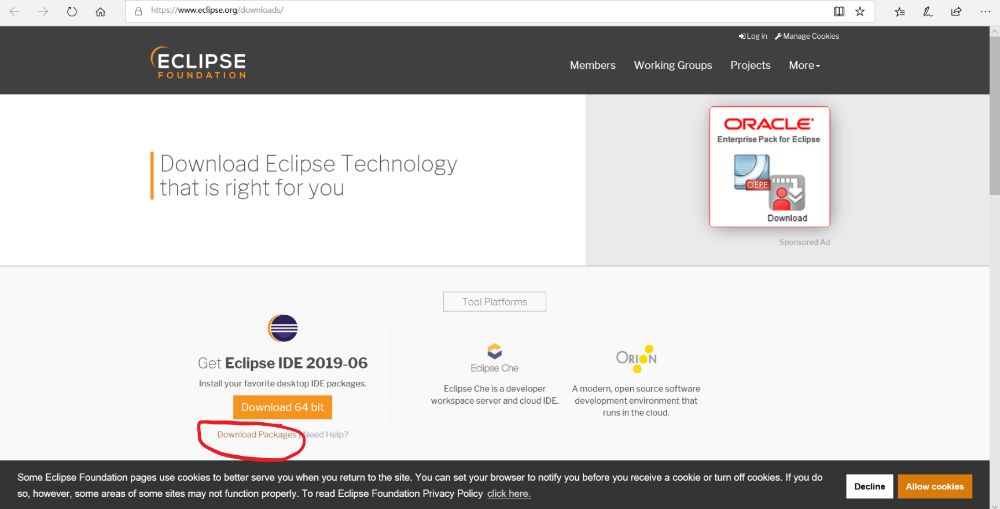
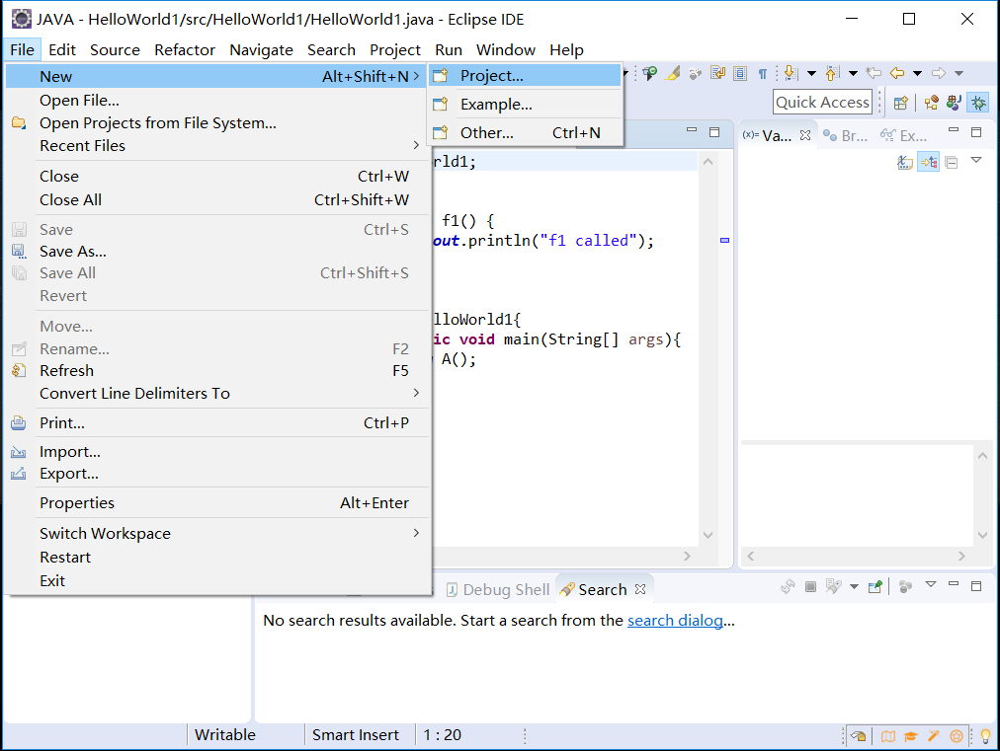

上了第一节JAVA课后，老师然我们自己下去安装Eclipse以及JAVA的jdk，也是费了我一番功夫，在这里简单总结一下，希望能帮助到大家

# 1.Eclipse的下载与安装
直接百度搜索Eclipse，下面第一个就是官网，进入官网我们选择downlaoad packages

然后选择对应的要下载的版本，我这里选的是Windows

<!-- more --> 
直接下载的话速度可能会非常慢，可以把镜像改成国内的，会快很多

最后按默认安装即可

# 2.HelloWorld的实现
打开eclipse后选择New->Project->java project

在project name输入HelloWorld
在Module name也输入HelloWorld
然后在左边的视图里找到src，右键创建一个package，接着在你创建的package上右键创建一个class ，class名为HelloWorld
然后写上代码即可

如图所示，点击右上角运行即可，下方即会出现HelloWorld
# 3.jdk的下载与jdk的配置
百度jdk第一项便是[oracle](https://www.oracle.com/technetwork/java/javase/downloads/index.html)官网
进入后下载对应的版本即可!

我下的是最后一项,windows的zip
然后经行环境的配置
打开系统的环境变量
首先新建一个系统变量JAVA_HOME
变量值为你的jdk路径，注意是你自己的路径

接着再新建一个系统变量CLASSPATH
变量值为  ;%JAVA_HOME%\lib;%JAVA_HOME%\lib\tool.jar
复制过去就好

接着再系统变量的path里加上
%JAVA_HOME%\bin
与%CLASSPATH%即可

至此环境就配好了
我们可以在命令行里分别输入java 与 javac 来查看是否配置成功
如果成功则应出现相应的内容

我的个人博客 amazingz6.github.io
我的CSDN https://blog.csdn.net/qq_44105654
我的简书 https://www.jianshu.com/u/607ef08e5825
我的github https://github.com/AmazingZ6?tab=repositories
我的bilibili https://space.bilibili.com/66908429